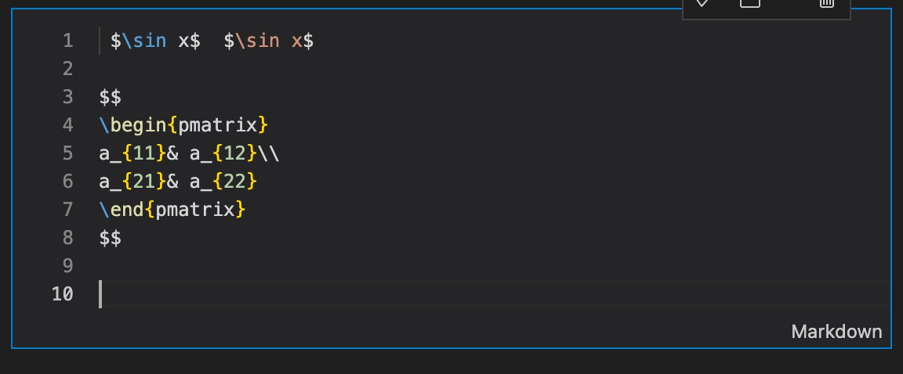
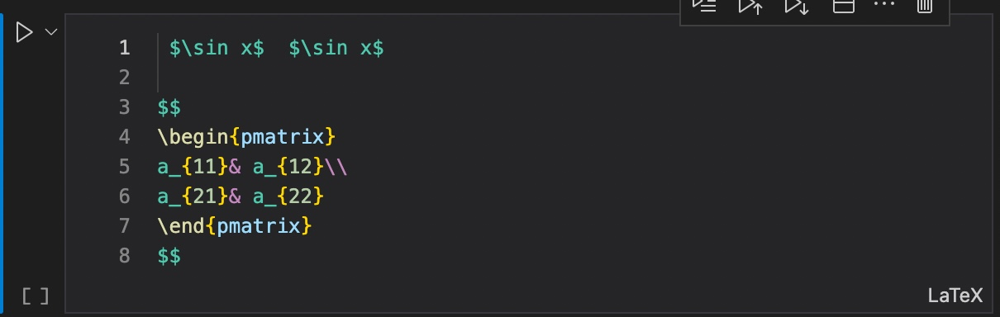
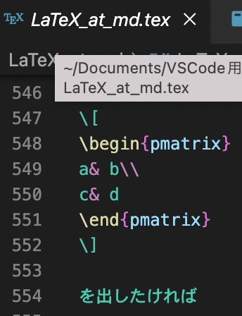
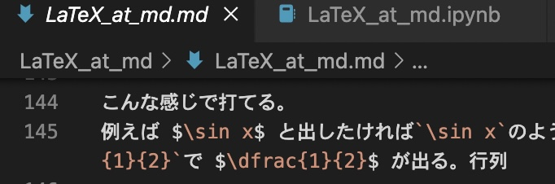

<script src="main.js"></script>
  <script type="text/javascript" id="MathJax-script" async
    src="https://cdn.jsdelivr.net/npm/mathjax@3/es5/tex-mml-chtml.js">
    </script>
  <script>
    MathJax = {
      loader: { load: ['[tex]/physics','[tex]/newcommand'] },
      tex: {
        inlineMath: [['$', '$'], ['\\(', '\\)']],
        packages: { '[+]': ['physics', 'newcommand'] },
      },
      chtml: {
        matchFontHeight: false
      }
    };
  </script>
  

# Markdown で $\LaTeX$ する

Markdownは軽量のプログラミング言語である。数式をライブでレンダリングするMathJax,KaTeXを使えるところに目をつけて数式を書くために使ってみた。 $\LaTeX$ との違いはコンパイルの概念がないことだろうか。とはいえ導入に一筋縄ではいかないことに気付いたのでメモしておく。

## VSCodeのユーザースニペット
初期設定ではoffになっているので忘れずにonにしておくこと。
早速だが下の表を見てほしい。


|     |  latex | md | .tex | .md | "latex" |
|-------|--------|----|------|-----|---------|
| .     | ○      | ○  | ×    | ○   | ×       |
| /     | ○      | ○  | ×    | ○   | ×       |
| __と** | ○      | ×  | ○    | ×   | ○       |
| @     | ×      | ×  | ○    | ×   | ×       |
| \     | ×      | ×  | ○    | ○   | ×       |


これはVSCodeのユーザースニペットで一文字でスニペットを出してくれるかくれないかを表す表である。
先頭からjupyternotebookにおいてlatexは青と黄色にハイライトされている時、mdはオレンジの時、.tex,.mdはそれぞれ拡張子.tex、.mdのファイルで開いた時、"latex"はjupyterの言語設定を"latex"に変えたものである。この表は相当錯綜しているが、なんとなくMarkdownでは $\LaTeX$ でいうところの`@`と`\`の代わりに`.`と`/	`が使えそうだとわかるはずだ。
下は上からlatexとmd、"latex"、.tex、.mdの時をとった写真である。マークダウン中で数式がオレンジになっているところがマークダウン、青や黄色がlatexの扱いらしい。








実際打ってみるとこんな感じ


[動画](latex_at_md_files/SS_2022-06-14_16-01-31.mov)


## ユーザースニペットの定義の仕方

###  $\LaTeX$ からの輸入
基本的には $\LaTeX$ のように数式を打つのだから全く同じように打ちたいと考える。どうやって打つかがきもになる。LaTeX Workshopに準拠したいと考えるならPC上の/Users/home/.vscode/extensions/james-yu.latex-workshop-8.27.2/data/at-suggestions.jsonから`@`で始まるスニペットを輸入するのがおすすめ。とはいえ元のコードを書き換えるわけにはいかないからコピペするのが最も安全だろう。/Users/home/.vscode/extensions/james-yu.latex-workshop-8.27.2/snippets/latex.jsonにもその他の役に立つスニペット（フォントに関することはMarkdownでは使わない）があるのでこちらもコピペがおすすめ。

### 変換
輸入したスニペットはそのままでは使えない。上の表にある仕様のせいである。回避するには例えば`cmd+shift+L`を押すなどしてat-suggestions内の全コードの`@`を`.`または`/`に変えてしまうのがいいだろう。ついでに例えば`\alpha`のコードをちょっといじって`\alpha `にしてしまう（空白を入れる）のもおすすめ。こうするとスニペットで`\alpha `を出した後に空白を打たなくて済む。

### 割り当て

コピーした上でどの記号を何に割り当てるのかは結構重要である。ちなみに自分は主要なものだと下のようにしている。
```json
~/Library/Application Support/Code/User/snippets/latexmd.code-snippets
	"inline_math2": {
		"prefix": "/",
		"scope": "latex,markdown",
		"body": " $$1$ $0"
	},
	"\\left( \\right)2": {
		"prefix": "..",
		"scope": "latex,markdown",
		"body": "\\left($1\\right)$0"
	},
	"\\left| \\right|2": {
		"prefix": ".|",
		"scope": "latex,markdown",
		"body": "\\left|$1\\right|$0"
	},
	"\\left{ \\right}2": {
		"prefix": ".{",
		"scope": "latex,markdown",
		"body": "\\left\\{$1\\right\\}$0"
	},
	"\\left[ \\right]2": {
		"prefix": ".[",
		"scope": "latex,markdown",
		"body": "\\left[$1\\right]$0"
	},
	"別行立て数式2": {
		"prefix": "ma",
		"body": [
			"",
			"$$",
			"${1}",
			"$$",
			"",
			"${0}"
		]
	},
	"and2": {
		"prefix": ".",
		"scope": "latex,markdown",
		"body": "& "
	},
	"dfrac": {
	"prefix": "//",
	"scope": "latex,markdown",
	"body": "\\dfrac{$1}{$2}$0"
	},
	"inline_code": {
	"prefix": ".,",
	"body": "`$1`$0"
	},
```
ポイントは`scope`を`"latex,markdown"`にしておくこととスニペットファイルをグローバルにしておくことである。命令が既にあるものと重なるものは必ず`2`をつけて表した。`inline_math2`は挙動がLaTeX Workshopのinline_mathと近くなるようにしておいた。（向こうでは`\`を打つところをこっちでは`/`を打っている。前後に空白を空けている。）`left` `right`系のコマンドはあまり変えなかったが`.|`を付け足したのと元の`@(`がちょっと打ちにくいので`..`に変えておいた。別行立ての数式は普通にmathのアルファベット。`inline_code`は打ちやすい位置にした。


## Jupyter Notebookを使う

自分はMarkdownをJupyter Notebookで打っている。ただの.mdファイルで打たないのは一定の利点があるためである。

### セルの分割
Jupyter Notebook は本来 Python 等のコードを書くためのものであるからセルに分割されている。つまり途中セーブのようなことができて精神衛生的にいい。これは $\LaTeX$ に対しても言えることである。

### コードの編入が楽
ソースコードを入れるときに一回Pythonのセルに投げ込んでその言語に変えればソースコードのコードを見なくて済む。

### jupyter-nbconvert が優秀
jupyter-nbconvert はPython を入れたときにデフォルトで一緒についてきたコマンドである。ターミナルで以下のコマンドを実行するだけで変換してくれる。例えばhtmlにしたければ下のようにする。（pdf,latex,markdown等にしたければそれぞれ帰れば勝手になる）


```python
jupyter-nbconvert --to html [変換したいファイルのパス]
```

この優秀なところは結構質の良いhtmlファイル、texファイルに変換してくれることである。特にtexファイルへの変換の優秀さはpandocのコマンドに比べて特筆すべきものがある。（なぜかCloud LaTeXでもうまくmdを変換してくれない）要はmdからpdfにするよりもipynbからjupyter-nbconvertでpdfにする方が精度が高いというわけである。なおipynbから変換したからといってセル毎に分割されて小さく組版されるなどということはない。

## 実際に数式を打ってみる

こんな感じで打てる。
例えば $\sin x$ と出したければ`\sin x`のように打てば良い。分数を出したければ`\dfrac{1}{2}`で $\dfrac{1}{2}$ が出る。行列

$$
\begin{pmatrix}
a& b\\
c& d
\end{pmatrix} 
$$

を出したければ
```latex
$$
\begin{pmatrix}
a& b\\
c& d
\end{pmatrix} 
$$
```
のようにすれば良い。マークダウンセルとしてコメントアウトしたければデフォルト？では`cmd+.`または`<!--   -->`で囲むことによって可能。
```markdown
<!-- あああ　コメントです　いい -->
```
数式中で $\LaTeX$ に従ってコメントすることもできる。
例）
入力
```latex

$$
\sin x+% \cos x 
$$

$$
<!-- \sin x -->
$$


```
出力

$$
\sin x+% \cos x
$$

$$
<!-- \sin x -->
$$


であるので数式中で`<!--  -->`を使うのはグレーかもしれない。


```python

```

<script src="https://blz-soft.github.io/md_style/release/v1.2/md_style.js" ></script>
